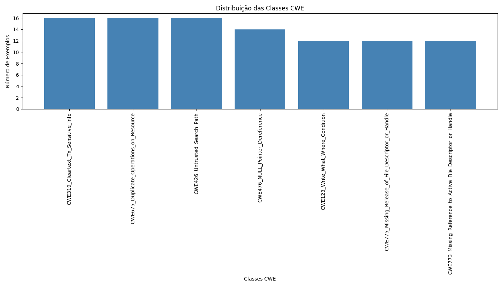

# Classificador de Vulnerabilidades CWE

Este projeto tem como objetivo classificar falhas de segurança em códigos C/C++ utilizando modelos de aprendizado de máquina. O sistema foi desenvolvido para identificar vulnerabilidades a partir de um conjunto de falhas previamente treinadas, utilizando dois tipos de modelos: Random Forest e CodeBERT.

## Índice

- Descrição dos Scripts
- Descrição Técnica
- Melhorias no Projeto - Pré-processamento
  - Modo 1: Foco nos Identificadores
  - Modo 2: Embeddings Enriquecidos
  - Benefícios
- Objetivo do Projeto
- Dependências
- Apresentação/Trabalho
  - Random Forest
    - Execução dos Scripts
    - Distribuição das Classes CWE
    - Treinamento do Modelo
    - Detalhes da Matriz de Confusão
    - Resultados Finais
- Contribuições
- Licença

## Descrição dos Scripts

1. **Carregar e Processar Conjuntos de Dados (`load_and_process_cwe_datasets.py`):**  
   Este script carrega e processa os arquivos de código C/C++, pré-processando-os utilizando Tree-Sitter para gerar tokens e associar rótulos de falhas baseados no tipo de vulnerabilidade (CWE). Os dados processados são salvos em arquivos JSON para uso posterior no treinamento dos modelos de classificação.

   **Execução:**
   ```
   python3 load_and_process_cwe_datasets.py --base_path <diretório_dos_dados> --minFiles <número_mínimo_de_arquivos> --maxFiles <número_máximo_de_arquivos>
   ```

2. **Pipeline de Treinamento (`train_model.py`):**  
   Este script carrega e pré-processa os dados, treinando um modelo Random Forest com os vetores extraídos do código utilizando Word2Vec. Ele também gera arquivos JSON contendo os vetores, rótulos e mapeamento das falhas, necessários para a classificação posterior.

   **Execução:**
   ```
   python3 train_model.py --base_path <diretório_dos_dados> --minFiles <número_mínimo_de_arquivos> --maxFiles <número_máximo_de_arquivos>
   ```

3. **Classificador (`classify.py`):**  
   Este script classifica novos arquivos de código C++ em uma das falhas (CWE) treinadas anteriormente, utilizando os modelos Random Forest ou CodeBERT. O classificador pode ser executado em dois modos, dependendo da escolha do usuário.

   **Execução:**
   ```
   python3 classify.py --file <caminho_do_arquivo> --model_type <random_forest|codebert> --model <caminho_para_o_modelo> --label_map <caminho_para_o_label_map>
   ```

## Descrição Técnica

O modelo foi treinado utilizando um conjunto de dados contendo códigos C/C++ com falhas de segurança conhecidas, categorizadas em diferentes tipos de vulnerabilidades, como buffer overflow, falhas de controle de fluxo, entre outras.

### Vetorização com Tree-Sitter e Word2Vec
- **Tree-Sitter:** Utilizado para análise sintática e geração de tokens dos códigos.
- **Word2Vec:** Gera vetores de palavras a partir dos tokens processados.
- **Random Forest:** Modelo de classificação que utiliza os vetores gerados para identificar as vulnerabilidades.

### Modelo CodeBERT
- **CodeBERT:** Rede neural pré-treinada da Hugging Face para análise de código, que tokeniza e classifica os códigos diretamente, sem necessidade de vetorização manual.

## Melhorias no Projeto - Pré-processamento

A evolução no pré-processamento de código representa um marco importante no desenvolvimento do projeto, permitindo uma análise mais detalhada e assertiva. O pré-processamento agora conta com dois modos complementares que aprimoram significativamente os embeddings gerados:

### Modo 1: Foco nos Identificadores

Neste modo, o pré-processamento prioriza apenas os elementos semânticos do código, como nomes de variáveis, funções e classes. Essa abordagem simplificada é eficiente para tarefas que dependem exclusivamente da identificação dos componentes principais do código, sendo ideal para cenários com menor complexidade.

### Modo 2: Embeddings Enriquecidos

O segundo modo vai além dos identificadores, incorporando elementos semânticos e estruturais do código. Ele inclui:

- **Identificadores:** Variáveis, funções, classes.
- **Estruturas de Controle:** Instruções como `if`, `for`, e `while`.
- **Diretivas do Pré-processador:** Como `#include` e `#define`.
- **Literais:** Strings, números e valores específicos do código.

#### Benefícios
- **Melhor compreensão do fluxo de execução.**
- **Capacidade de identificar relações contextuais.**
- **Maior detalhamento dos padrões de codificação.**

## Objetivo do Projeto

Construir um sistema que, ao receber um código C/C++, seja capaz de classificar o tipo de falha de segurança (CWE) presente, com base em falhas conhecidas previamente treinadas.

## Dependências

O projeto foi desenvolvido para rodar em **plataforma Ubuntu** e possui as seguintes dependências:

- **Python 3.x**
- **pip** (gerenciador de pacotes Python)

### Instalação das Dependências

1. **Crie um ambiente virtual:**
    ```
    python3 -m venv tree-sitter-env
    source tree-sitter-env/bin/activate
    ```

2. **Instale as dependências:**
    ```
    pip install -r requirements.txt
    ```

**Conteúdo do `requirements.txt`:**
```
tree-sitter
gensim
scikit-learn
transformers
torch
numpy
pandas
```

## Apresentação/Trabalho

### Modelo Random Forest

#### Pipeline de Processamento e Vetorização de Código com Tree-Sitter e Word2Vec

Foi utilizado o seguinte comando para processar os conjuntos de dados:
```
python3 load_and_process_cwe_datasets.py --base_path /home/fbiaso/dados/Documentos/PLN/C/testcases --maxFiles 16 --minFiles 10
```

#### Distribuição das Classes CWE

A execução do script gerou uma base de dados cuja distribuição das classes pode ser visualizada na imagem abaixo:



---
---
#### Treinamento do Modelo // Teste 1 // [test_size=0.3, n_estimators=100, vector_size=100]

O modelo foi treinado utilizando o seguinte comando:
```
python3 ./train_cwe_model.py --data_dir ./ --word2vec_model_path word2vec.model
```

##### Acurácia Média:
A acurácia média das classes é de **83%**.

---

#### Treinamento do Modelo // Teste 2 // [test_size=0.3, n_estimators=200, vector_size=100]

O modelo foi treinado utilizando o seguinte comando:
```
 python3 ./train_cwe_model.py --data_dir ./ --word2vec_model_path word2vec.model --test_size 0.3 --random_state 44 --n_estimators 200 --vector_size 100
```

##### Acurácia Média:
A acurácia média das classes é de **87%**.

---

#### Resultados Finais

Este documento apresenta um relatório com os parâmetros de pré-processamento, modelo utilizado, acurácia geral, e outros detalhes relacionados à classificação.

| Parâmetros                                        | Tipo de Pré-processamento | Modelo        | Acurácia Geral | Quantidade Total de Dados | Quantidade de Classes | Método de Representação | Percentual de Acerto |
|---------------------------------------------------|---------------------------|---------------|----------------|---------------------------|-----------------------|--------------------------|----------------------|
| test_size=0.3, ***n_estimators=50***, vector_size=100  | Tree-Sitter (ABS)         | Random Forest | 80%            | 123                       | 7                     | Word2Vec                 | 28.57%                  |
| test_size=0.3, ***n_estimators=100***, vector_size=100  | Tree-Sitter (ABS)         | Random Forest | 87%            | 123                       | 7                     | Word2Vec                 | 28.57%                  |
| test_size=0.3, ***n_estimators=200***, vector_size=100  | Tree-Sitter (ABS)         | Random Forest | 87%            | 123                       | 7                     | Word2Vec                 | 28.57%                  |
| test_size=0.3, ***n_estimators=1000***, vector_size=100  | Tree-Sitter (ABS)         | Random Forest | 87%            | 123                       | 7                     | Word2Vec                 | 28.57%                  |
| test_size=0.3, n_estimators=100, ***vector_size=20***  | Tree-Sitter (ABS)         | Random Forest | 83%            | 123                       | 7                     | Word2Vec                 | 28.57%                  |
| test_size=0.3, n_estimators=100, ***vector_size=40***  | Tree-Sitter (ABS)         | Random Forest | 83%            | 123                       | 7                     | Word2Vec                 | 28.57%                  |
| test_size=0.3, n_estimators=100, ***vector_size=80***  | Tree-Sitter (ABS)         | Random Forest | 83%            | 123                       | 7                     | Word2Vec                 | 28.57%                  |
| test_size=0.3, n_estimators=100, ***vector_size=160***  | Tree-Sitter (ABS)         | Random Forest | 83%            | 123                       | 7                     | Word2Vec                 | 28.57%                  |
| ***test_size=0.1***, n_estimators=100, vector_size=100  | Tree-Sitter (ABS)         | Random Forest | 90%            | 123                       | 7                     | Word2Vec                 | 28.57%                  |
| ***test_size=0.15***, n_estimators=100, vector_size=100  | Tree-Sitter (ABS)         | Random Forest | 93%            | 123                       | 7                     | Word2Vec                 | 28.57%                  |
| ***test_size=0.16***, n_estimators=100, vector_size=100  | Tree-Sitter (ABS)         | Random Forest | 100%            | 123                       | 7                     | Word2Vec                 | 28.57%                  |
| ***test_size=0.20***, n_estimators=100, vector_size=100  | Tree-Sitter (ABS)         | Random Forest | 90%            | 123                       | 7                     | Word2Vec                 | 28.57%                  |

## Descrição dos Parâmetros

- **Parâmetros**: Configurações utilizadas no modelo, como tamanho do teste (`test_size`), número de estimadores (`n_estimators`), e tamanho do vetor (`vector_size`).
- **Tipo de Pré-processamento**: Técnica utilizada para pré-processamento dos dados (ex: Tree-Sitter).
- **Modelo**: O modelo de aprendizado de máquina utilizado (ex: Random Forest).
- **Acurácia Geral**: Percentual de acerto alcançado pelo modelo.
- **Quantidade Total de Dados**: Número de amostras utilizadas no modelo.
- **Quantidade de Classes**: Número de classes para a classificação.
- **Método de Representação**: Método usado para representar as palavras (ex: Word2Vec).
- **Percentual de Acerto**: Acurácia expressa como percentual de acerto.

---
